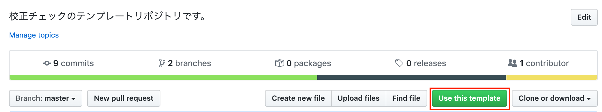

# このリポジトリの使い方
テンプレートリポジトリなので、Use This Templeateからリポジトリを作成して使用してください。  


CircleCIで校正チェックする場合は[こちら](./docs/CircleCI.md)

GitHub Actionsで校正チェックする場合は[こちら](./docs/GitHubActions.md)

# ローカルで文章をチェックする
[前提条件]  
ローカル環境にDockerがインストールされている必要があります。  

[Docker Imageをビルドする]  
初回利用時には、docker imageをビルドする必要があります。
プロジェクトルートから、以下のコマンドを実行してください。
```
sh ./local_check/buildImage.sh  
```

[チェック実行]
以下のコマンドで、チェックを実行できます。  
```
sh  ./local_check/check.sh  
```
実行結果は、プロジェクトルートに出力されるcheck.logに出力されます。  

# チェック対象のファイル
チェック対象のファイルは、/articles に格納してください。  
（できれば設定ファイルで自由にフォルダを指定できるようにしたい。）

# チェック内容
チェックの設定ファイルは、rules/ に格納しています。
必要に応じて変更してください。  
