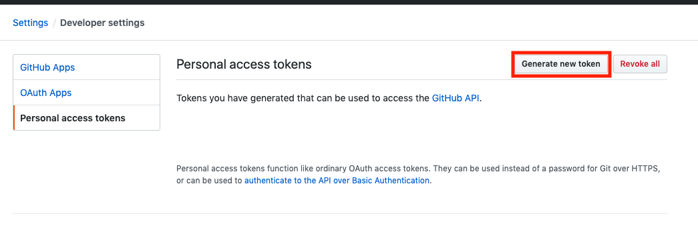
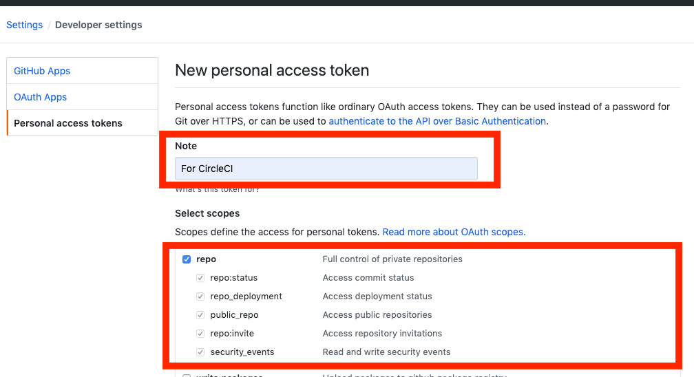
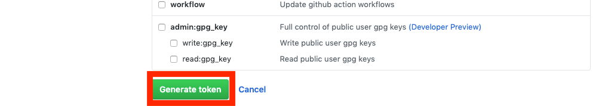
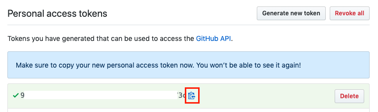
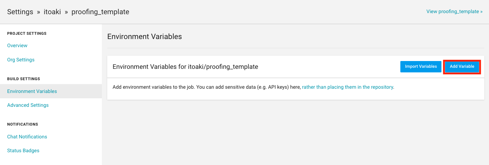
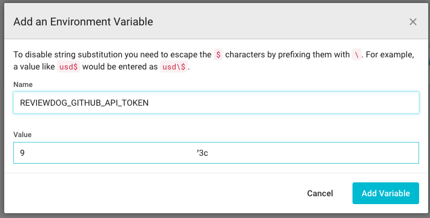
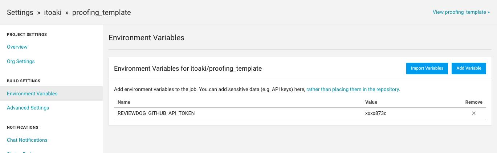

# ローカルで文章をチェックする
初めて使用する場合は、docker imageのビルドが必要です。  
プロジェクトルートから、  
sh ./local_check/buildImage.sh  

以下のコマンドで、チェックを実行。  
sh  ./local_check/check.sh  

# チェック対象のファイルは、/articles に格納してください。

# Circle CIを使用するときの設定
GitHubトークンを生成します。  
まずは、以下のURLにアクセス  
https://github.com/settings/tokens

「Generate new token」を押下

Noteを記入し、Select scopesのrepoにチェックを入れる

一番下までスクロールし、「Generate token」を押下

トークンがコピーできるので、コピーしておく。  
(上にも注意が出てますが、この画面閉じるとコピーできなくなるので、再作成が必要になります。)

次はCircleCiの設定  
以下のURLにアクセスする。  
https://circleci.com/gh/[アカウント名]/[リポジトリ名]/edit#env-vars

「Add Variable」を押下

Nameに「REVIEWDOG_GITHUB_API_TOKEN」を設定し、Valueに先ほどコピーしたトークンを貼り付け  
Add Variableを押下

これで準備完了

