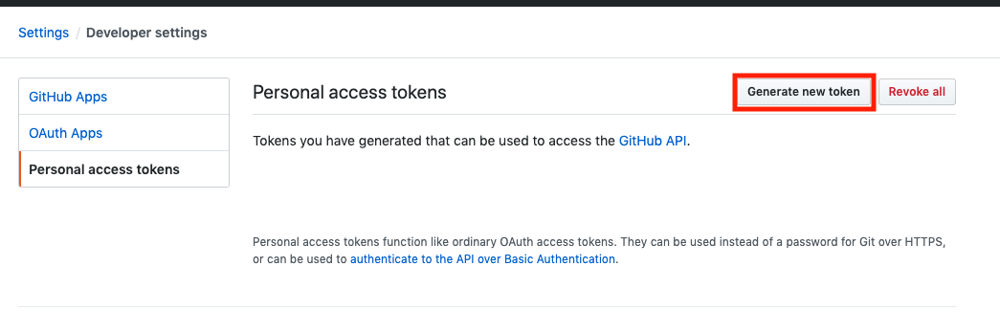
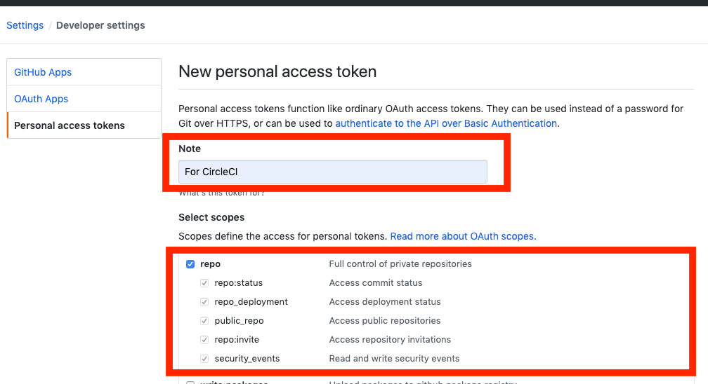
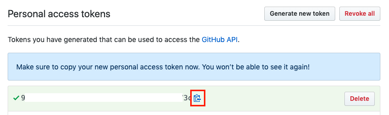
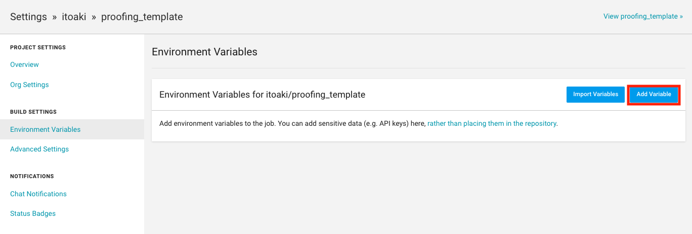
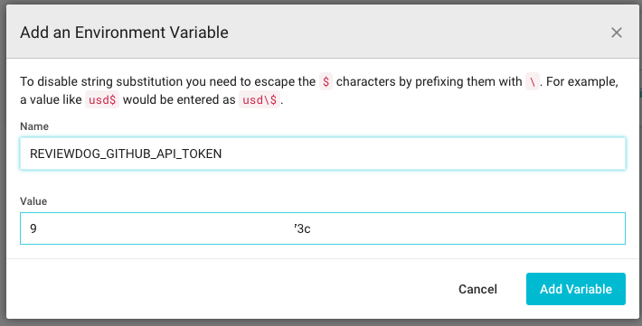
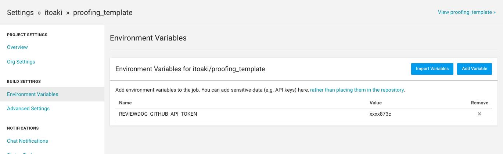

# 1.ReviewDogの設定
Review Dogでプルリクエストに、チェックした内容をコメントを追加するためのトークンを登録します。

## 1-1.GitHubトークンを生成します。  

以下のURLにアクセスします。  
https://github.com/settings/tokens

「Generate new token」を押下します。  


Noteを記入し、Select scopesのrepoにチェックを入れます。  


一番下までスクロールし、「Generate token」を押下します。  


トークンがコピーできるので、コピーしておきます。  
(上にも注意が出てますが、この画面閉じるとコピーできなくなるので、再作成が必要になります。)


## 1-2.CircleCiの設定  
以下のURLにアクセスします。  
https://circleci.com/gh/[アカウント名]/[リポジトリ名]/edit#env-vars

「Add Variable」を押下します。  


Nameに「REVIEWDOG_GITHUB_API_TOKEN」を設定し、Valueに先ほどコピーしたトークンを貼り付けます。  
貼り付けたら、Add Variableを押下します。  


これで準備完了です。  


# 2.不要ファイルを削除する
.github 以下のフォルダは、CircleCIでは使用しないため、削除してください。  
```
rm -rf .github
```
